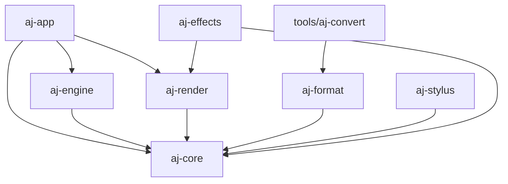

# Crate dependency graph

## Notes

- `aj-core` is the root data-type crate: pure types, no threading, no GPU. Everything depends on it.
- `aj-engine` is the only writer of `Document` state; `aj-render` and `aj-app` are read-only consumers of `SceneSnapshot` it publishes.
- `aj-app` is the wiring crate — it depends on everything else and produces the binary.
- `tools/aj-convert` is outside `crates/` so it never ships inside the app binary.
