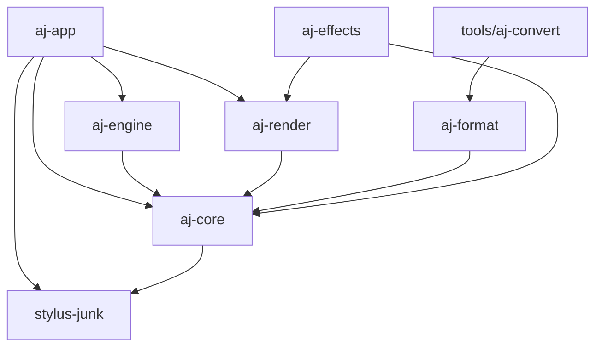

# Crate dependency graph

## Notes

- `stylus-junk` is the input-sample + adapter crate. Lives at the bottom of the graph so
  it's standalone-publishable (input is a general problem, not art-junk-specific). Owns
  `Sample` / `ToolCaps` / `PointerId` / `SampleRevision` / `ToolKind` plus the
  `StylusAdapter` state machine and per-platform backends behind opt-in features
  (`mac`, `windows`, `wayland`, `x11`, `ios`, `android`, `web`, `winit`, `kurbo`).
- `aj-core` depends on `stylus-junk` and re-exports its input types, so the rest of the
  workspace keeps using `aj_core::{Sample, ToolCaps, …}` as before. `aj-core` holds the
  document/scene-graph types (Brush, Stroke, Page, Edit, History) that are the
  art-junk-specific layer on top of input.
- `aj-engine` is the only writer of `Document` state; `aj-render` and `aj-app` are read-only consumers of `SceneSnapshot` it publishes.
- `aj-app` is the wiring crate — it depends on everything else and produces the binary.
- `tools/aj-convert` is outside `crates/` so it never ships inside the app binary.
