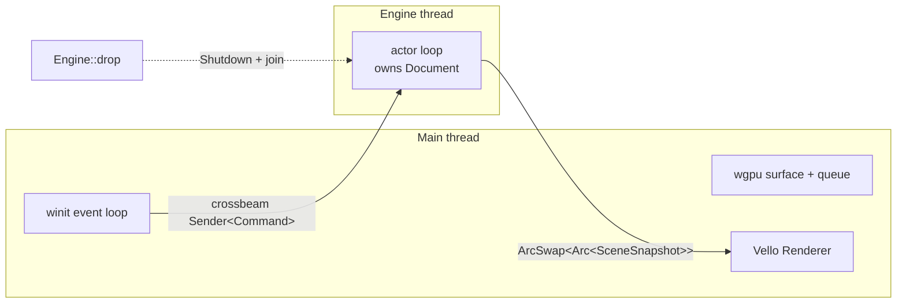

# Threading model

## Notes

- **Main thread**: winit event loop, GPU surface management, Vello rendering, UI chrome (when added). Must never block more than the ~4ms frame budget.
- **Engine thread**: owns authoritative `Document`; sole writer. Idle on `recv()` when no input; drains + publishes in batches.
- **Worker pool (future)**: when M6+ adds long tasks (save, effect resolve, brush texture), they go into a `rayon` pool the engine dispatches to. Not yet present in M2.
- **Shutdown**: `Engine::drop` sends `Shutdown` through the same channel and joins the thread, so no orphan thread on app exit.
- **Web degradation**: on WASM, the "Engine thread" collapses into the main event loop; same Command/Event plumbing, executed cooperatively. See `CLAUDE.md` § Architecture.
